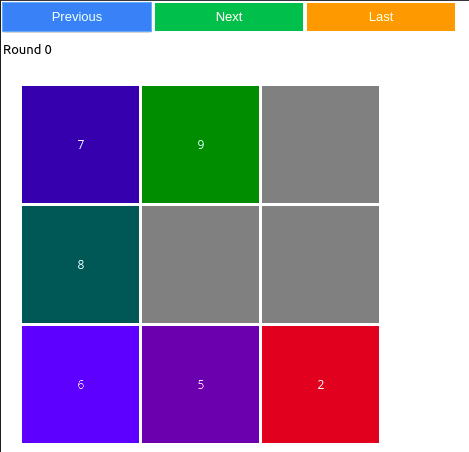
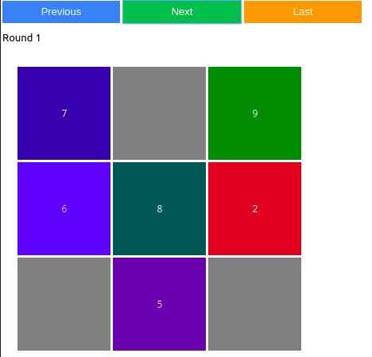
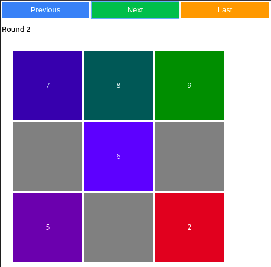
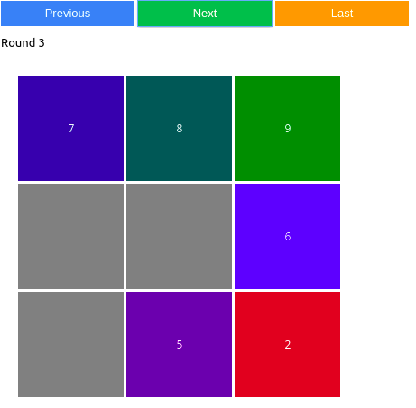
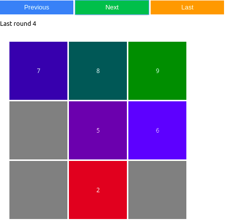

# Puzzle - Multi-Agent Interaction

We have developed a multi-agent system whose role is to reconstruct a puzzle using a cognitive approach. In the modeling that is proposed, each agent represents a piece of the puzzle, which is of size n*n.

#### Run Game

- Create a notebook and copy the code below :

```python
from puzzle_working import Board
board = Board(5,10,13,50)
board()
```

#### Authors

- Arthur Sarmini Det Satouf
- Céline Goncalves
- Thomas Danguilhen

#### Current work

 Our code is an implementation of a solution for the **Taquin puzzle** using a **multi-agent system**. The puzzle is represented as a board, which is a square matrix of size N. The goal is to move the tiles on the board to reach a specific configuration where the tiles are ordered from 0 to N*N-1 from top to bottom and from left to right, with the empty cell in the last position. The solution uses multiple agents, where each agent is responsible for moving a specific tile to its correct position. Each agent runs on a separate thread and uses message passing to communicate with other agents.

**The Agent** class is defined as a subclass of **Thread**. The **run** method is the entry point of the thread. Each agent keeps track of its current position and target position on the board. In each turn, the agent receives messages from other agents, decides on its next move based on the received messages, and broadcasts its next position and priority to other agents. The priority determines the order in which conflicts between agents are resolved. A conflict occurs when two or more agents want to move to the same position in the same turn. The agent with the higher priority wins the conflict, and the other agent(s) are forced to move elsewhere.

**The Board** class represents the game board and the current state of the puzzle. It contains methods for initializing the board, moving tiles, getting the position of agents and targets, and checking if the puzzle is solved.

**The Message** class represents the messages exchanged between agents. It contains the sender ID, the current position of the sender, the next position of the sender, and the priority of the message.

**The Barrier** class is used to synchronize the threads at the end of each turn. When all agents have finished their turn, the **Barrier** is released, and the next turn starts. The **lock** attribute is used to ensure that only one agent at a time modifies the state of the board.

**The handle_conflicts** method of the Agent class is responsible for resolving conflicts between agents. If the agent receives a message from another agent that wants to move to the same position with higher or equal priority, the agent moves to an alternative position. If the agent receives a message from another agent that wants to move to the same position with lower priority, the agent wins the conflict and moves to the desired position. If the agent receives multiple conflicting messages, it recursively tries to find an alternative path.

**The broadcast** method is used to send a message to all other agents. **The recursive** method is used to find an alternative path in case of conflicts. If the agent cannot find a valid path, it indicates that it does not want to move by broadcasting its current position with a high priority.

#### Demo

- Round 0 


- Round 1 


- Round 2 


- Round 3 


- Last round 4 




#### Future enhancements

There are several ways our implementation could be improved:

- **Efficiency**: The implementation of the algorithm could be optimized to reduce computation time. For example, the `recursive()` function currently performs a depth-first search to resolve conflicts. This can be slow for large boards or complex scenarios. Alternative conflict resolution methods could be explored, such as a more efficient search algorithm or using machine learning techniques to learn how to avoid conflicts.

- **Flexibility**: The code is currently designed to work with a specific board and set of agents. To make the code more flexible, it could be modified to accept input parameters for the board size, number of agents, and starting positions. Additionally, the code could be made more modular, with separate functions for the various components of the algorithm, so that different parts of the algorithm can be modified or replaced as needed.

- **Robustness**: The code could be made more robust to handle unexpected scenarios, such as agents that stop responding or become stuck in a loop. One possible solution would be to implement a timeout mechanism to detect when an agent is taking too long to respond, and take appropriate action (such as assuming the agent has crashed and removing it from the board). Another approach would be to implement a loop detection mechanism to detect when an agent is stuck in a loop, and take appropriate action (such as forcing the agent to take a different path).
